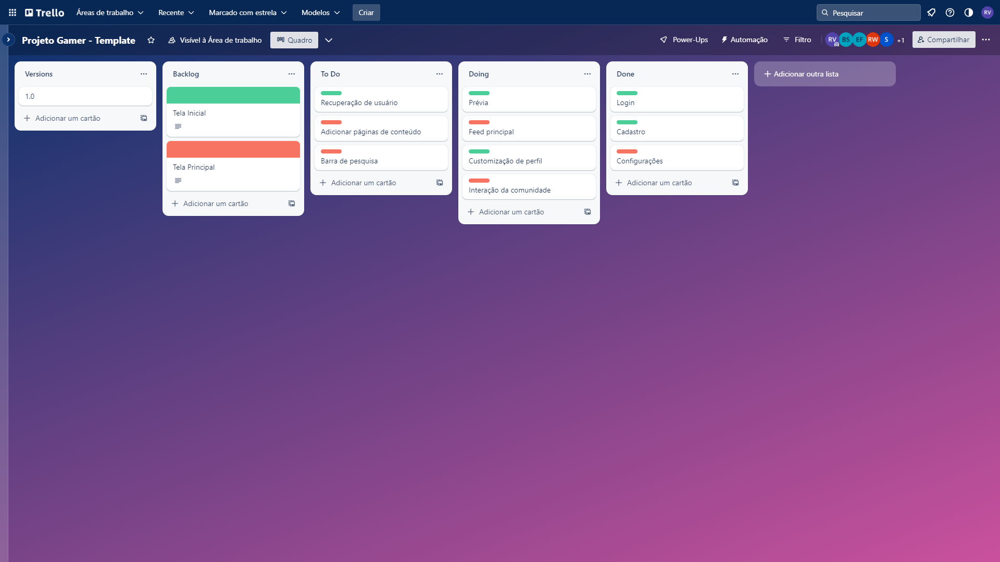

# Metodologia

A metodologia contempla as definições de ferramental utilizado pela equipe tanto para a manutenção dos códigos e demais artefatos quanto para a organização do time na execução das tarefas do projeto 

## Controle de Versão

A ferramenta de controle de versão adotada no projeto foi o
[Git](https://git-scm.com/), sendo que o [Github](https://github.com)
foi utilizado para hospedagem do repositório.

O projeto segue a seguinte convenção para o nome de branches:

- `main`: versão estável já testada do software
- `unstable`: versão já testada do software, porém instável
- `testing`: versão em testes do software
- `dev`: versão de desenvolvimento do software

Quanto à gerência de issues, o projeto adota a seguinte convenção para
etiquetas:

- `documentation`: melhorias ou acréscimos à documentação
- `bug`: uma funcionalidade encontra-se com problemas
- `enhancement`: uma funcionalidade precisa ser melhorada
- `feature`: uma nova funcionalidade precisa ser introduzida

## Gerenciamento de Projeto

### Divisão de Papéis

A equipe utiliza metodologias ágeis, tendo escolhido o Scrum como base para definição do processo de desenvolvimento. 
A equipe está organizada da seguinte maneira:

<b>Scrum Master:</b>
- Giovani Gomes  

<b>Product Owner:</b> 
- Paula Oliveira   

<b>Equipe de Desenvolvimento:</b>
- Rafael Volpi 
- Siderley Tadeu 
- Bianca Cristina 
- Enzo Ferrante 
- Lucas Di Vito 
- Richard Marinho  

<b>Equipe de Design:</b>
- Letícia Torres 

### Processo

Para organização e distribuição das tarefas do projeto, a equipe está utilizando o Trello estruturado com as seguintes listas:  

- <b>Backlog:</b> recebe as tarefas a serem trabalhadas e representa o Product Backlog. Todas as atividades identificadas no decorrer do projeto também devem ser incorporadas a esta lista. 
- <b>To Do:</b> Esta lista representa o Sprint Backlog. Este é o Sprint atual que estamos trabalhando. 
- <b>Doing:</b> Quando uma tarefa tiver sido iniciada, ela é movida para cá. 
- <b>Done:</b> Nesta lista são colocadas as tarefas que passaram pelos testes e controle de qualidade e estão prontos para ser entregues ao usuário. Não há mais edições ou revisões necessárias, ele está agendado e pronto para a ação. 

### Ferramentas

As ferramentas empregadas no projeto são:

- <b>Editor de código:</b> Visual Studio Code 
- <b>Ferramentas de comunicação:</b> Discord e Whatsapp 
- <b>Ferramentas de desenho de tela:</b> MarvelApp 
 
Utilizamos o Visual Studio Code como editor de código devido à quantidade de informações disponíveis na internet. Qualquer dúvida pode ser facilmente resolvida com um pouco de pesquisa. Para comunicação, usamos o Discord para chamadas e o WhatsApp para contato diário sobre o andamento do projeto. Por fim, escolhemos o Marvel App como ferramenta de desenho de tela, devido à sua facilidade de uso, que possibilitou a construção de um protótipo de acordo com nossas ideias. 
