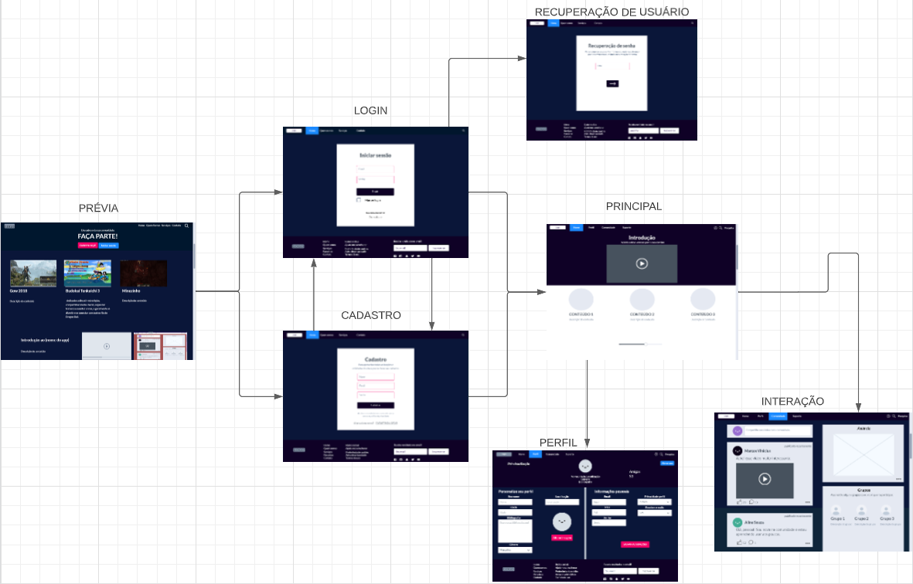
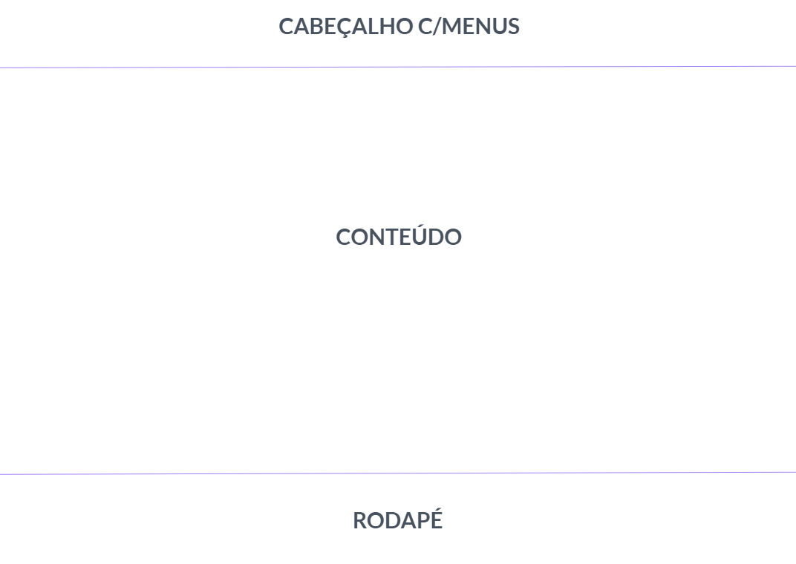
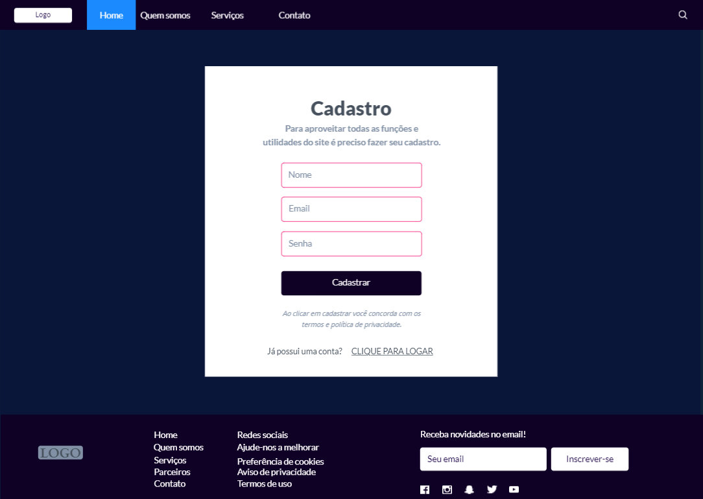
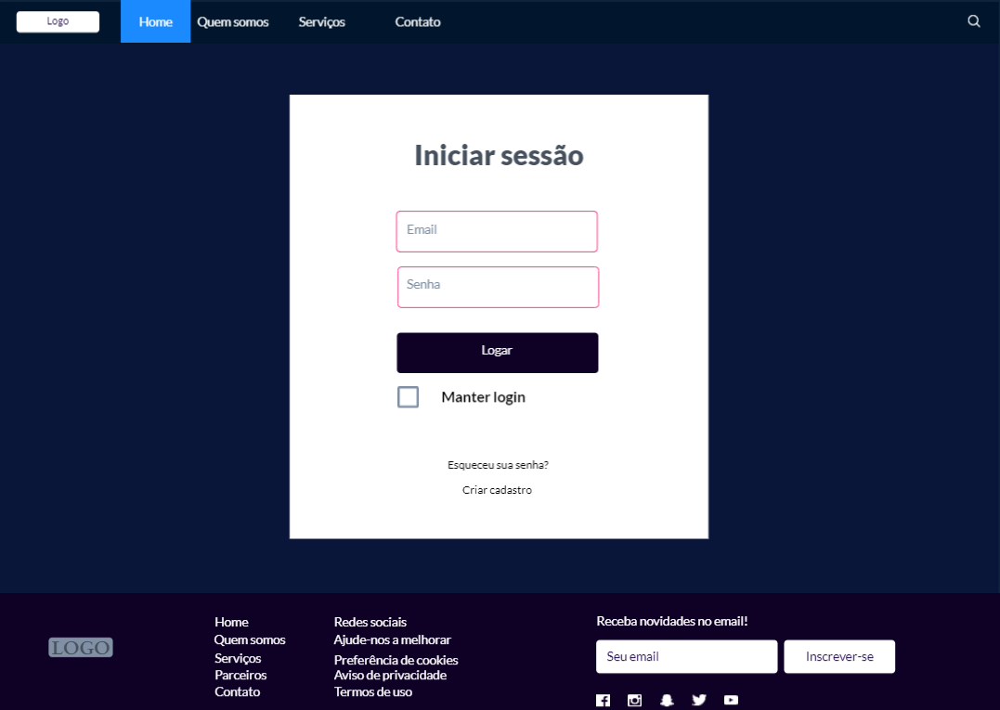
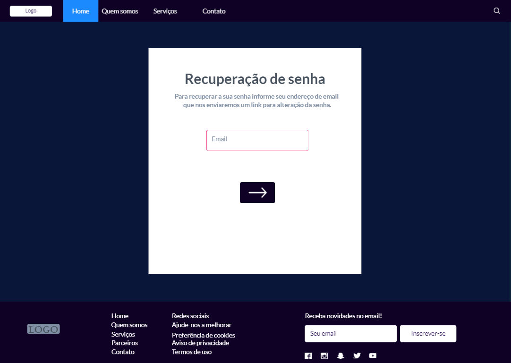
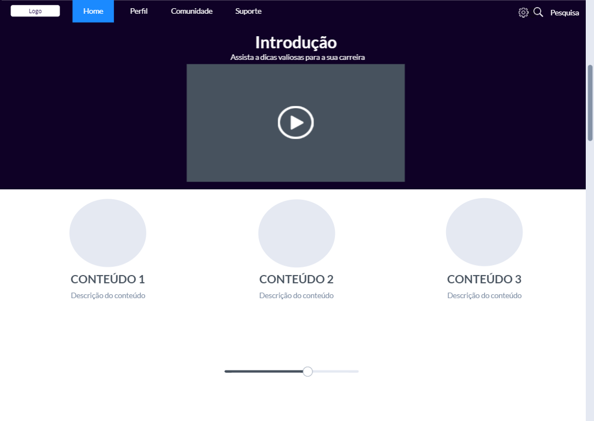
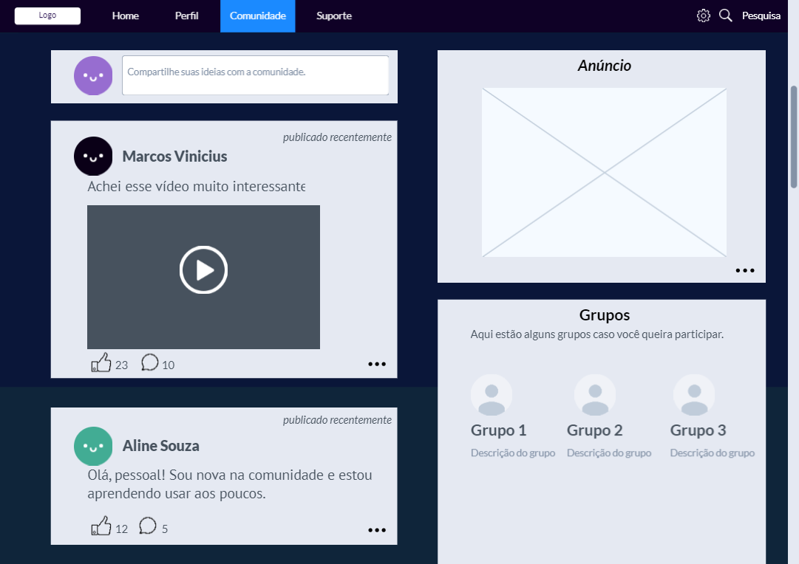
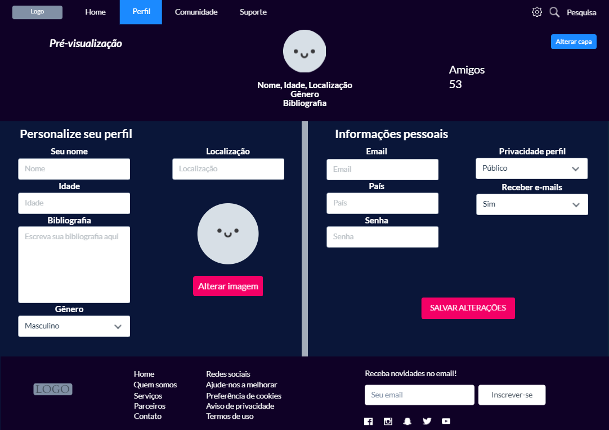

# Projeto de Interface

Dentre as preocupações para a montagem da interface do 	sistema, estamos estabelecendo foco em questões como agilidade, acessibilidade e usabilidade. Desta forma, o projeto tem uma identidade visual padronizada em todas as telas que são projetadas para funcionamento em desktops e dispositivos móveis.

## User Flow

O diagrama apresentado mostra o fluxo de interação do usuário pelas telas do sistema.

## Wireframes

As telas do sistema apresentam uma estrutura comum.

### <b>TELA - INICIAL</b> 
A tela inicial mostra os destaques do site a partir da API utilizada pelo sistema
Com base na estrutura padrão, o bloco de Conteúdo traz as notícias em destaque (imagem, título, descrição). O protótipo compõe duas funções iniciais principais e as futuras funções.

### <b>CADASTRO</b> 
A tela de cadastro, o usuário é direcionado para informar seus dados e se tornar membro do site.

### <b>LOGIN</b> 
A tela de login, o usuário é direcionado a informar seus dados para efetuar seu login no sistema.

### <b>RECUPERAÇÃO DE USUÁRIO</b> 
A tela de recuperação, o usuário deverá fornecer seus dados que foram cadastrados para poder ter a chance de recuperá-los. 

### <b>PRINCIPAL</b> 
A tela principal apresentará, notícias específicas e informação de direcionamento de acordo com a preferência do usuário.

### <b>INTERAÇÃO</b> 
A tela de interação permite a interação com outros usuários da comunidade, sendo possível adicionar mais conteúdos informativos e participar de grupos específicos criados pela própria comunidade abrangendo diversos assuntos. 

### <b>PERFIL</b> 
A tela de perfil o usuário possui a liberdade de customização. Sendo escolher sua foto de destaque, alterar capa e informações públicas referente ao próprio. 

