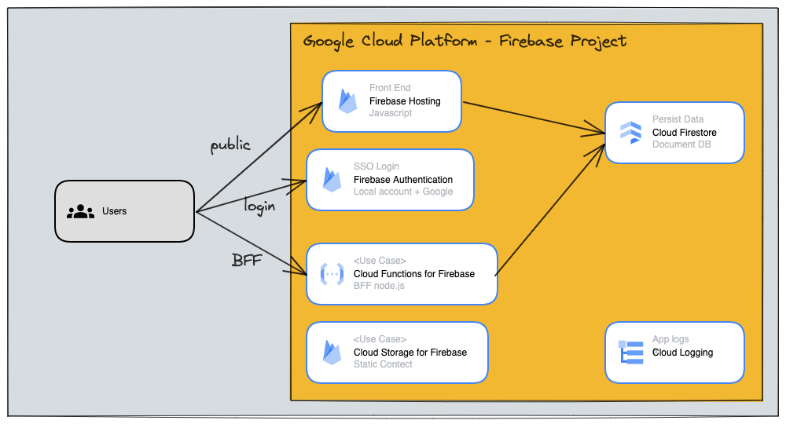
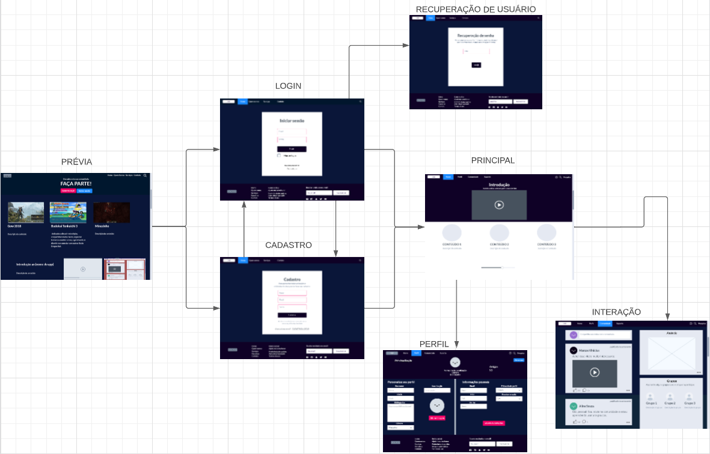

# Arquitetura da Solução

Pré-requisitos: <a href="3-Projeto de Interface.md"> Projeto de Interface</a>

Definição de como o software é estruturado em termos dos componentes que fazem parte da solução e do ambiente de hospedagem da aplicação.

## Diagrama de componentes

Os componentes que fazem parte da solução são apresentados na Figura 01. Diagrama elaborado com excalidraw, com a imagem de componentes. Os usuários poderão acessar o site de maneira publica e privada, com hosting em Google Cloud.

Figura 01 - Arquitetura da Solução

A solução implementada conta com os seguintes módulos:
- **Navegador** - Interface básica do sistema.
  - **Páginas Web** - Conjunto de arquivos HTML, CSS, JavaScript e imagens que implementam as funcionalidades do sistema.
   - **Local Storage** - armazenamento mantido no Navegador, onde são implementados bancos de dados baseados em JSON. São eles: 
     - **Minha Conta** - seção com perfil do usuário e com ações responsivas.
 - **Módulo de login** - autenticação por firebase com criação de contas e SSO Google.
 - **Hospedagem** - Firebase hosting para conteudo web, bff e storage.

> **Links Úteis**:
>
> - [Google Cloud Diagram](https://googlecloudcheatsheet.withgoogle.com/architecture)

Com base aos fluxos, a landing page contará com informações iniciativas e conteúdo global (tela 01), bem como uma alternativa para criar conta ou cadastrar (telas 02 e 03), com uma opção para recuperar cadastro (tela 04).
Um vez conectado, há um menu principal (tela 05) com conteúdo customizado com base ao escolhido no perfil (tela 06). Finalmente, se pleanteiam opções para iteraçāo entre usuários (tela 07).

## Tecnologias Utilizadas

De hosting e infra cloud se utilizará Firebase Cloud, que conta com um stack completo para web. Se utilizará hosting web inicalmente (por validar: react.js, nest.js) em javascript com conteúo responsivo e também conteúdo estático HTML e CSS. Para os serviços web se utilizarão apis em padrão bff (backend for front) em node.js.
Se utilizará blob storage (bucket) para conteúdo estático extra quando necessário e um banco de dados não relacional (documental), firestore.

Se ocuparão livrarias da Google Firebase para autenticação de usuarios, logging e error reporting, analytics, integrações com outros serviços GCP. Se toma essa decisão principalmente pela flexibilidade e dinamismo, dado que se utilizarão os emuladores de firebase para o desenvolvimento.

De perpectiva do desenvolvedor, também se utilizará Visual Code Studio, npm e yarn como pkg managers, e caso se decida por react.js se ocupará Codux como visual IDE. 

## Hospedagem

Explique como a hospedagem e o lançamento da plataforma foi feita.

> **Links Úteis**:
>
> - [Firebase Emulators](https://firebase.google.com/docs/emulator-suite)
> - [Website com GitHub Pages](https://pages.github.com/)
> - [Programação colaborativa com Repl.it](https://repl.it/)
> - [Getting Started with Heroku](https://devcenter.heroku.com/start)
> - [Publicando Seu Site No Heroku](http://pythonclub.com.br/publicando-seu-hello-world-no-heroku.html)